# Nirliptah Yoga App 🧘‍♀️📱  

## About Nirliptah Yoga 🌍  
In a world where maintaining physical and mental well-being is increasingly essential, **Nirliptah Yoga App** bridges the ancient wisdom of yoga with cutting-edge mobile technology. Designed for yoga enthusiasts of all levels, the app offers a seamless experience tailored to personal goals, schedules, and expertise.  

Powered by the **Flutter framework** and **Dart programming language**, this app utilizes the **Model-View-ViewModel (MVVM)** architecture for a highly efficient, scalable, and user-friendly platform.  

Whether you're a complete beginner or a seasoned yogi, Nirliptah Yoga App makes yoga accessible and engaging anytime, anywhere.  

## Key Features 🌟  

1. **Personalized Yoga Experience** 👤  
   - Recommendations based on user profile: gender, age, skill level (Beginner, Intermediate, Expert).  

2. **Holistic Offerings** 📚  
   - **Workshops**: Manage your in-person yoga classes and schedules directly from the app.  
   - **Yoga Retreats**: Plan and book rejuvenating yoga retreats, including details about accommodation, meals, and schedules.  

3. **Digital Achievements** 🎓  
   - Automatically awards verified certificates upon course completion.  

4. **Modern Tech Integration** 🛠️  
   - Flutter-based cross-platform app for Android and iOS.  
   - MVVM architecture ensures separation of concerns, making the app maintainable and scalable.  

## Aims and Objectives 🎯  

### Aims:  
- To create a global yoga app that integrates tradition with technology.  
- To provide an accessible platform for yoga enthusiasts to connect, learn, and grow.  

### Objectives:  
1. Deliver an immersive yoga experience tailored to individual goals and needs.  
2. Incorporate AI-powered features to ensure correct posture and alignment.  
3. Simplify scheduling and booking of physical and virtual yoga sessions.  
4. Celebrate user milestones with digital certificates.  
5. Utilize MVVM architecture for a maintainable, responsive, and scalable app.  

## Technology Stack 🛠️  

- **Framework**: Flutter  
- **Programming Language**: Dart  
- **Architecture**: MVVM  
- **Tools**:  
  - Figma (UI/UX Design)  
  - Draw.io (Prototyping and System Design)  

## MVVM Architecture Overview 🏗️  

- **Model**: Handles the app's data layer, including API integrations and database operations.  
- **ViewModel**: Manages the app's logic and communicates between the Model and View.  
- **View**: Presents the user interface and binds directly to the ViewModel for a responsive experience.  

The **MVVM** pattern ensures:  
- Efficient data binding for a smoother user experience.  
- Clear separation of concerns for scalability and maintainability.  

## How to Contribute 🤝  

We welcome contributions from developers and designers worldwide!  
1. Fork the repository.  
2. Make your changes and submit a pull request.  
3. Report bugs or suggest features by opening an issue.  

## Contact 📬  

- GitHub: [Nirliptah Yoga Mobile-App GitHub](https://github.com/ashishmool/nirlipta-yoga-mobile.git)  
- LinkedIn: [Ashish Mool](https://www.linkedin.com/in/ashish-mool/)  

## Conclusion 🌿  
The **Nirliptah Yoga App** is more than just a tool; it's a wellness companion that empowers users to lead healthier, balanced lives. By integrating AI capabilities, user-centric design, and the timeless benefits of yoga, this app stands as a testament to how technology can enhance our connection to tradition and self-care. 🌱  

## 📸 Application Screenshots

Here are some screenshots of the Nirliptah Yoga App:

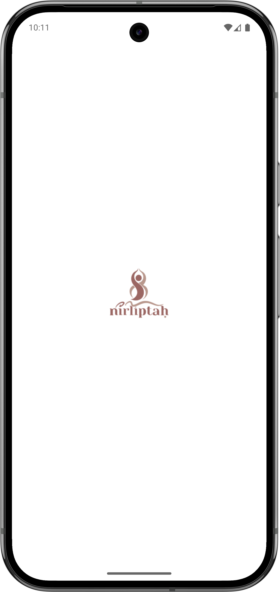
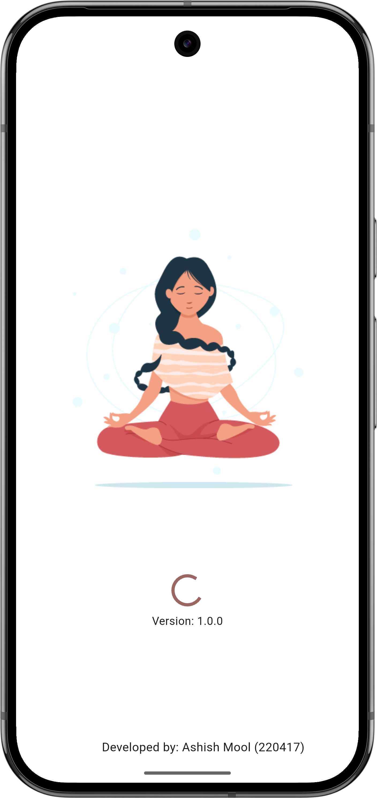
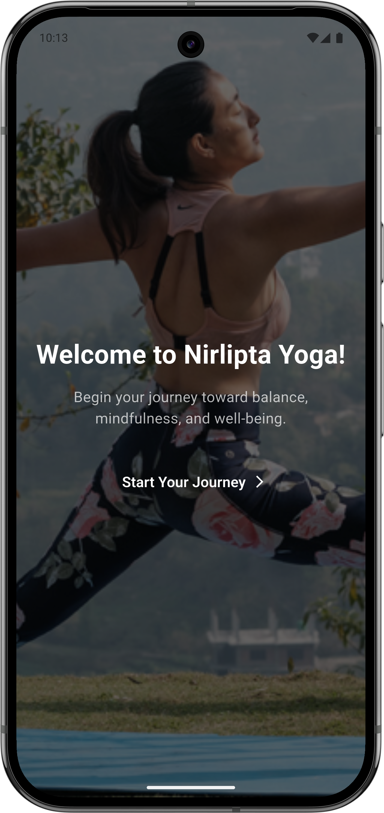
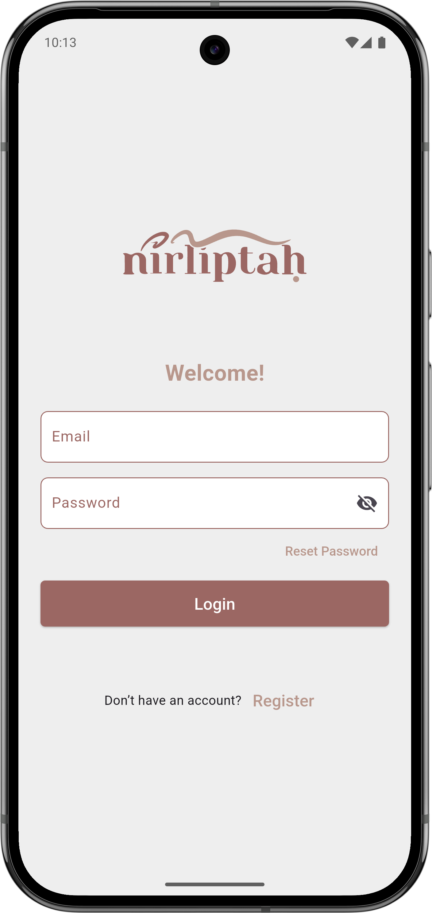
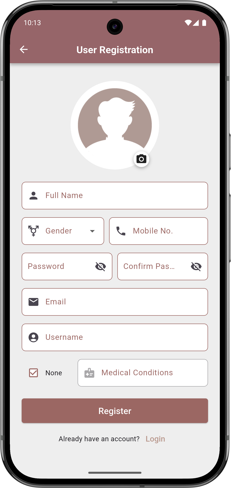
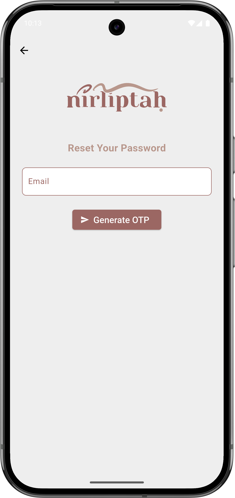

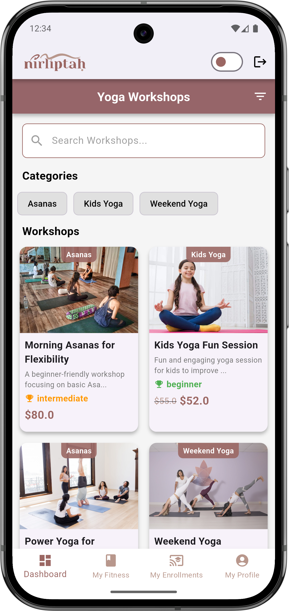
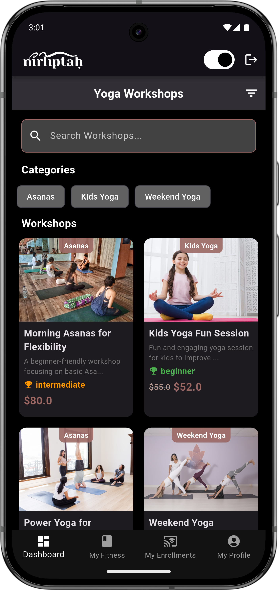
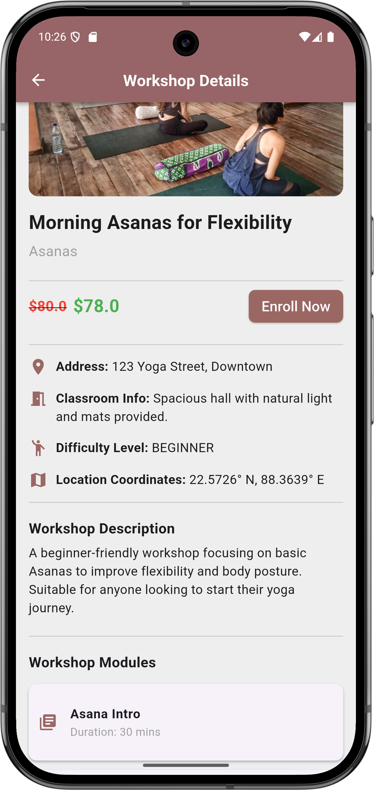
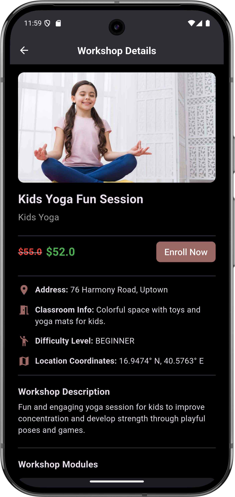
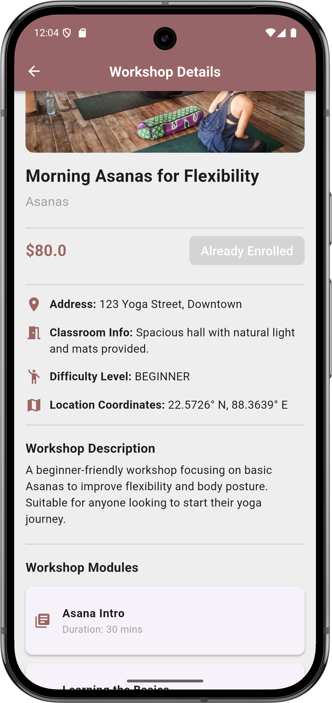
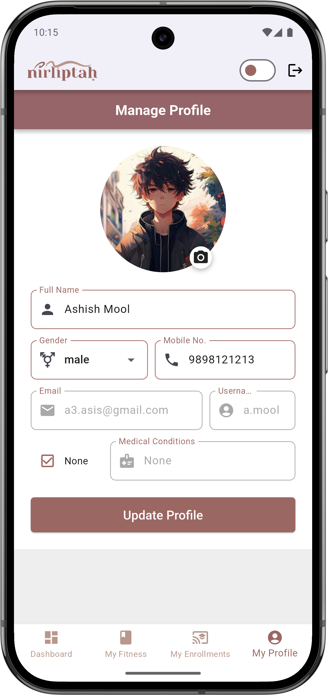
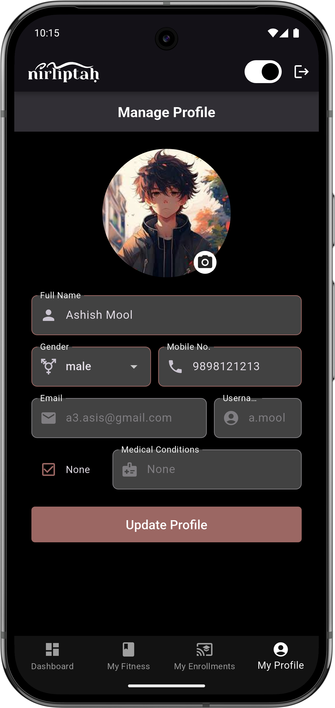
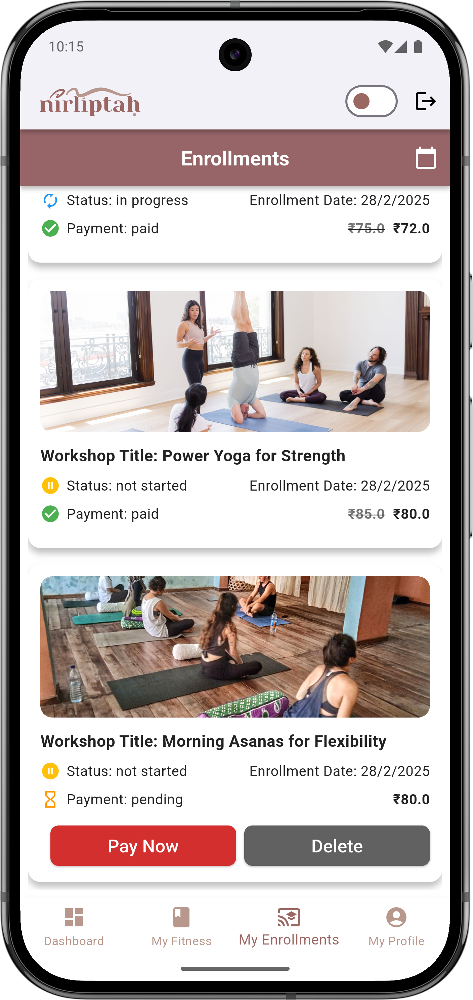
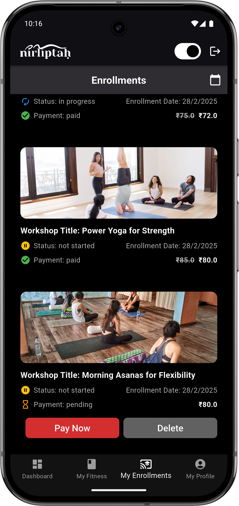
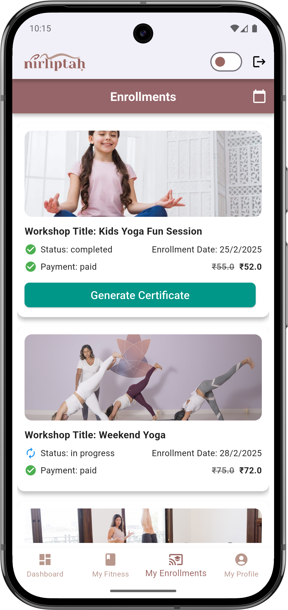
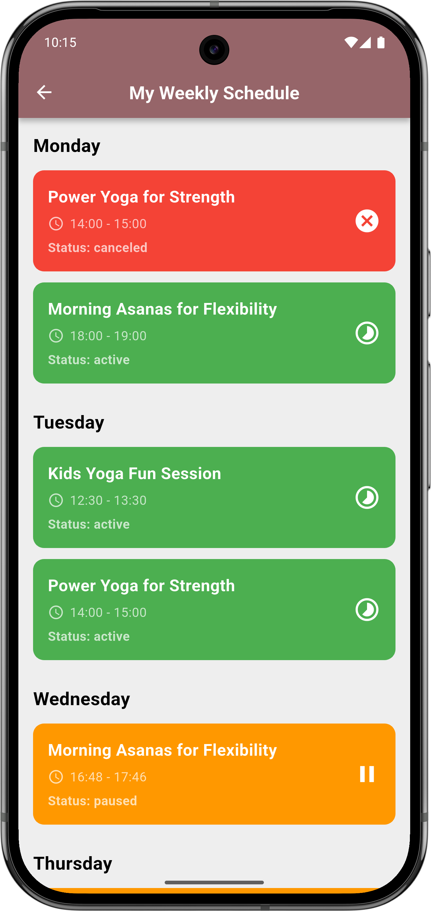
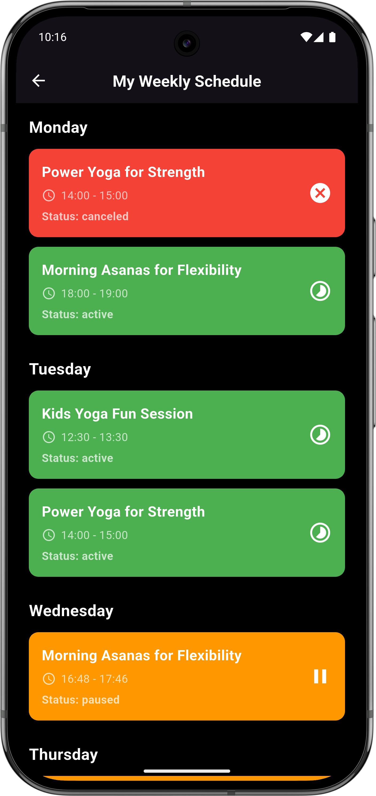
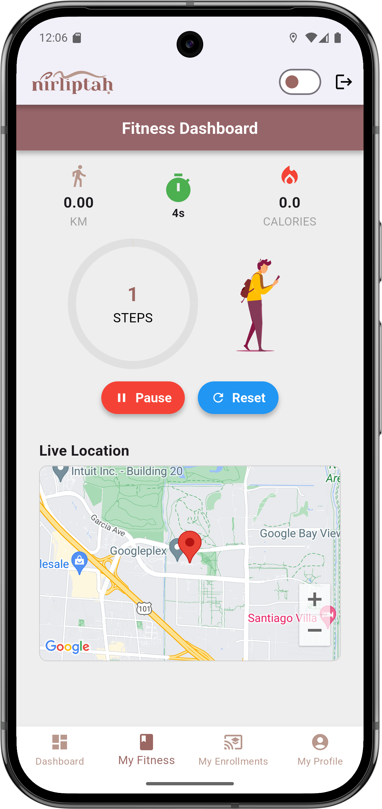
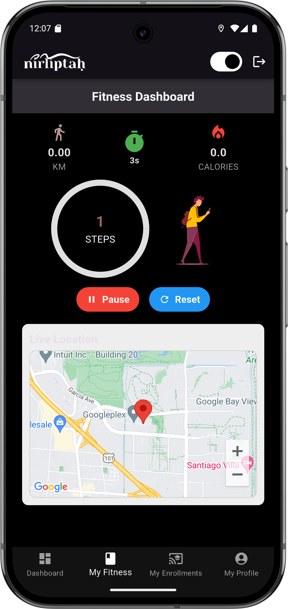
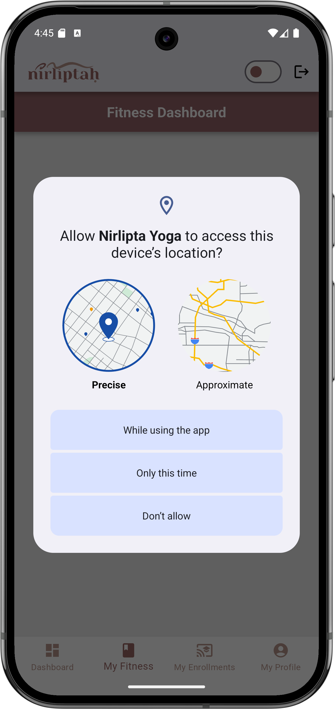
